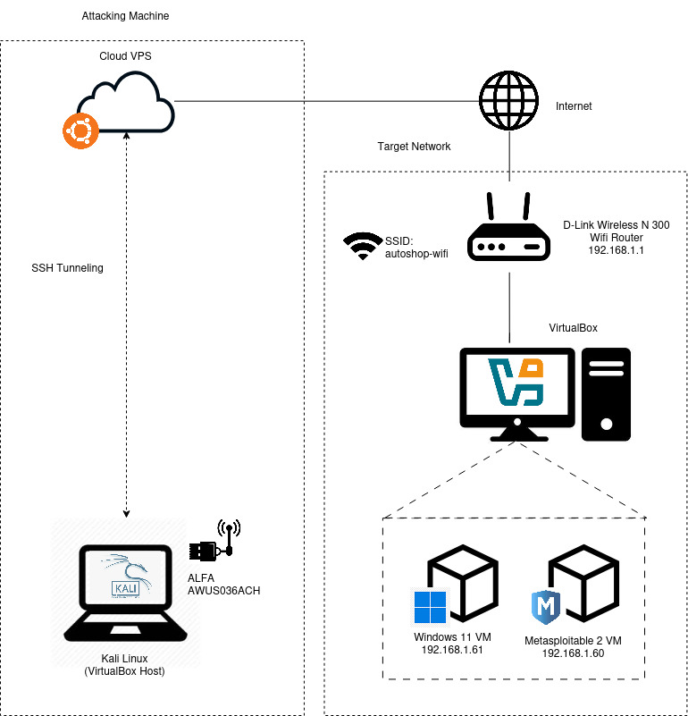

# Beginner Ethical Hacking Lab

This project documents my journey into the practical side of ethical hacking. The primary goal is to bridge the gap between theoretical knowledge from CompTIA Security+ with hands-on application, while also gaining proficiency with Kali Linux and common security tools.

The labs contained in this repository will cover various stages of a simulated attack, from initial network access to server and web application exploitation, and even social engineering tactics.

## Project Objectives

*   **Practical Learning:** Gain a deeper, practical understanding of attacker methodologies.
*   **Skill Development:** Develop hands-on skills with industry-standard ethical hacking tools.
*   **Lab Familiarization:** Become proficient in setting up and operating within a controlled hacking lab environment.
*   **From Theory to Practice:** Apply theoretical security concepts in real-world scenarios.

## High-Level Attack Scenario

The project simulates a multi-stage attack from the perspective of an external threat actor. The general flow is as follows:

1.  **Initial Access:** Gain entry into the target Wi-Fi network.
2.  **Network Reconnaissance:** Perform host discovery and service scanning on the local network.
3.  **Man-in-the-Middle (MITM):** Intercept and analyze network traffic.
4.  **Server Exploitation:** Attempt to exploit vulnerabilities on network servers (e.g., Metasploitable).
5.  **Web Application Penetration:** Target and exploit vulnerabilities in web applications.
6.  **Social Engineering:** If server-side attacks fail, pivot to attacking a user to gain a foothold.

## Lab Environment

### Network Diagram

Below is the architectural diagram of the lab setup, illustrating the network topology and the roles of each component.

### IP Addressing Scheme

For consistency and ease of reference, the following IP addressing scheme will be used for the virtual machines and cloud server:

| Host | Role | IP Address |
| :--- | :--- | :--- |
| D-Link Wireless N 300 | Wifi Router | 192.168.1.1 |
| Kali Linux VM | Attacker | 192.168.1.144 |
| Windows 11 VM | Target Client | 192.168.1.60 |
| Metasploitable 2 VM | Target Server | 192.168.1.61 |
| Ubuntu Cloud VPS | Remote Attacker Server | 101.99.74.214 |

### Hardware & Software

The following components are used to build the lab environment.

| Component | Specification / Name | Purpose | Cost |
| :--- | :--- | :--- | :--- |
| **Hypervisor** | VirtualBox (Hosted on Kali Linux Laptop) | Free hypervisor for hosting virtual machines. | free |
| **Attacker VM**| Kali Linux VM | The primary machine for conducting attacks. | free |
| **Target VM 1**| Windows 11 (Unlicensed) | A modern client OS target. | unlicensed |
| **Target VM 2**| Metasploitable 2 | A deliberately vulnerable Linux VM for exploitation practice. | free |
| **Router** | D-Link Wireless N 300 | A legacy router supporting older Wi-Fi encryption for practice. | RM36 |
| **Wi-Fi Adapter** | ALFA AWUS036ACH (RTL8812AU) | A Wi-Fi adapter that supports monitor mode and packet injection. | RM297.50 |
| **Cloud Server**| Ubuntu Cloud VPS | A remote server for delivering payload to external network. | RM29.05 monthly |

---

## Covered Topics

This repository explores a variety of attack techniques and the tools required to execute them.

### Attack Techniques Covered

| Category | Technique |
| :--- | :--- |
| **Network Access** | Dictionary Attack, Brute-force Attack (WPA/WPA2) |
| **Network Sniffing** | Man-in-the-Middle (MITM), ARP Spoofing, SSL Stripping |
| **Exploitation** | Remote Code Execution (RCE), Backdoors, Trojans |
| **Web Security** | SQL Injection (SQLi), Cross-Site Scripting (XSS), Remote File Inclusion (RFI) |

### Tools Covered

| Tool | Purpose |
| :--- | :--- |
| **aircrack-ng suite**| Wi-Fi network auditing and cracking. |
| **bettercap** | Framework for Man-in-the-Middle (MITM) attacks. |
| **Wireshark** | Network protocol analysis. |
| **nmap** | Network scanning and host discovery. |
| **Metasploit Framework** | Exploitation and payload delivery. |
| **BeEF XSS Framework**| Browser exploitation. |
| **sqlmap** | Automatic SQL injection and database takeover. |
| **ZAP Proxy** | Web application vulnerability scanning. |
| **AutoIT** | Scripting for automating Windows GUI actions (for payload creation). |

---

## Project Structure

This project is organized into folders, where each folder represents a specific challenge or attack scenario. Inside each folder, you will find a `README.md` file detailing:

*   **Scenario:** A description of the situation.
*   **Objective:** The goal of the attack.
*   **Tools Used:** A list of tools required for the challenge.
*   **Attack Overview:** A high-level summary of the attack steps.
*   **Steps to Reproduce:** A detailed, step-by-step walkthrough of the attack.

## :warning: Disclaimer

All information and code in this repository are for educational and research purposes only. Do **NOT** test these attacks on any system you do not own or have explicit, written permission to test. The author is not responsible for any misuse or damage caused by the information herein.
